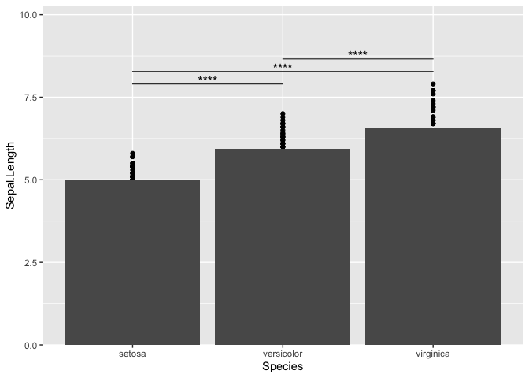

<!-- README.md is generated from README.Rmd. Please edit that file -->

# ggmulticomp

<!-- badges: start -->

<!-- badges: end -->

ggmulticomp provides several ggplot2 stat layer for multiple comparison.

## Installation

You can install ggmulticomp like so:

``` r
remote::install_github("myuhao/ggmulticomp")
```

## Example

``` r
library(ggplot2)
library(ggmulticomp)

iris |>
  tidyr::pivot_longer(-Species) |>
  dplyr::mutate(
    y = value, x = Species
  ) |>
  ggplot(aes(x = Species, y = value)) +
  geom_point() +
  stat_summary(geom = GeomCol) +
  stat_dunnett(color = "red") +
  facet_grid(rows = vars(name), cols = vars("a"), scale = "free_y")
#> No summary function supplied, defaulting to `mean_se()`
#> Warning: Removed 4 rows containing missing values or values outside the scale range
#> (`geom_text()`).
```


