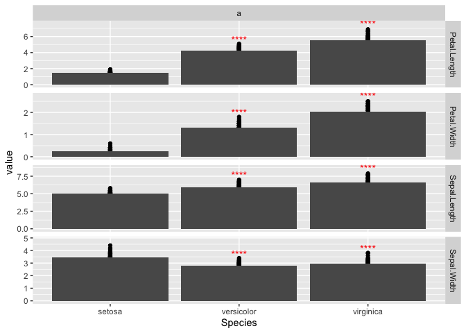

# ggmulticomp

ggmulticomp provides several ggplot2 stat layer for multiple comparison.

## Installation

You can install ggmulticomp like so:

``` r
remote::install_github("myuhao/ggmulticomp")
```

## Example

``` r
library(ggplot2)
library(ggmulticomp)

dat = iris |>
  tidyr::pivot_longer(-Species) |>
  dplyr::mutate(
    y = value, x = Species
  ) 

iris |>
  ggplot(aes(x = Species, y = Sepal.Length)) +
  geom_point() +
  stat_summary(geom = GeomCol) +
  stat_tukey() +
  scale_y_continuous(expand = expansion(mult = c(0, 0.3)))
#> No summary function supplied, defaulting to `mean_se()`
```


